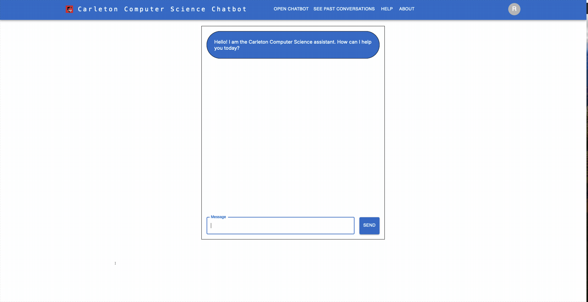

# Carleton CS LLM & Chatbot


[](https://github.com/Nguyen-HanhNong/star_book/network)
[](https://github.com/Nguyen-HanhNong/star_book/issues)
[](https://github.com/Nguyen-HanhNong/Carleton-CS-LLM-Chatbot/blob/master/LICENSE)
[](https://nodejs.org)
[](https://nodejs.org)

## What is this application?


This project is an implementation of a customized chatbot, powered by a Llama LLM model from Meta. The chatbot is designed to provide information about the Carleton University Computer Science program. The chatbot is built using NextJS, React, Material-UI, and OpenRouter and OpenAI API. 

## Getting Started

### Prerequisites

- The project requires Node.js and npm to run. If you do not have Node.js installed, you can download it [here](https://nodejs.org/en/download/).
- The project will also require a valid OpenRouter API key. You can find more about API key's and OpenRouter at their [website](https://openrouter.ai/docs/api-keys).

### Instructions

1. Clone the repository
   ```sh
   git clone

2. Install NPM packages
   ```sh
    npm install

3. Run the project
   ```sh
   npm run start

4. Open the project in your browser
   ```sh
   http://localhost:3000/

## Improvement and Advancements

- Implement an advanced RAG model for the chatbot to improve the quality of responses, especially relating to course specific content at Carleton University.
- Implement a more advanced and user-friendly UI for the chatbot, allowing users to rate the responses of the model and provide feedback.

## License

Distributed under the GNU General Public License v3.0. See `LICENSE` for more information.
